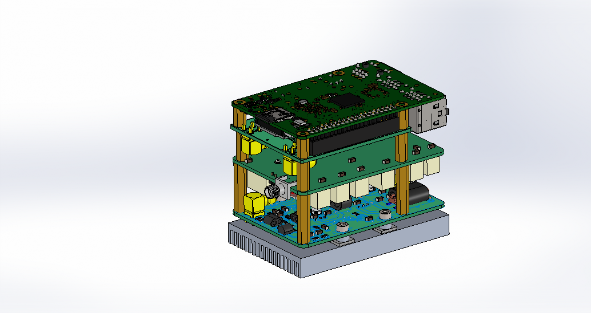
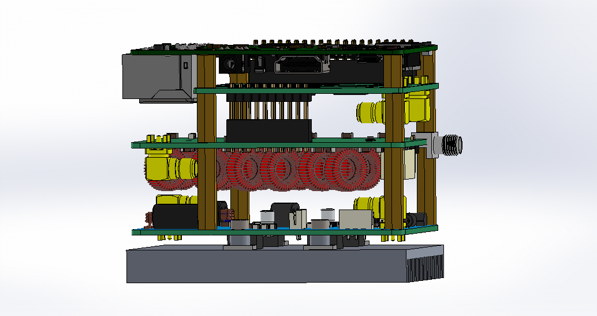
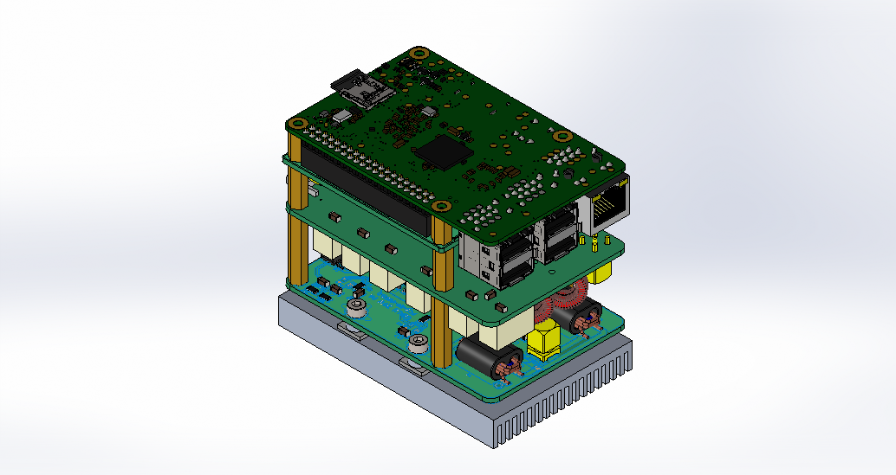
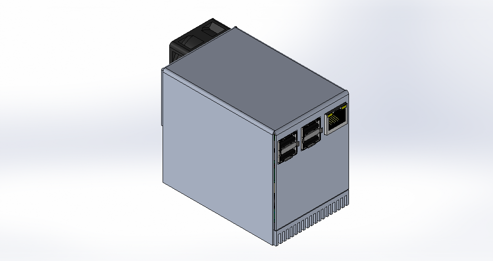
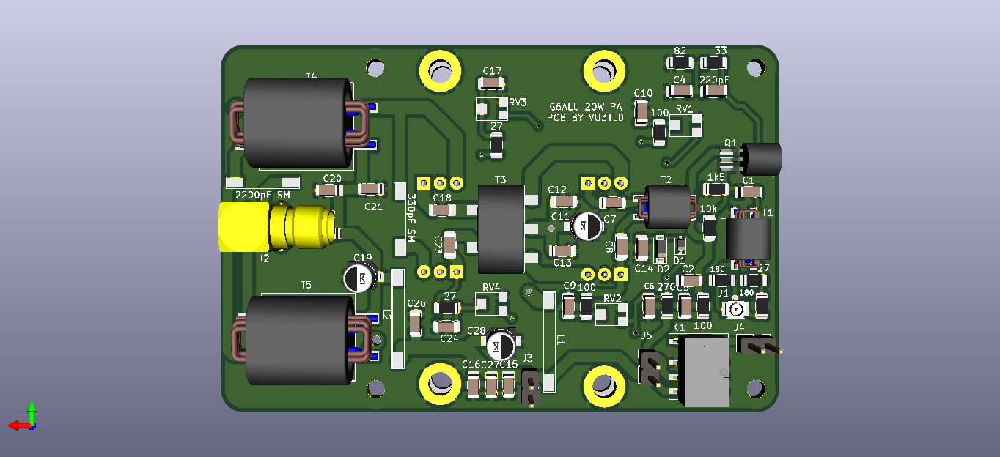

# Radioberry-2.x-extensions
Hardware extensions to the Radioberry Ham Radio

Deepu Augustin VU3TLD, from India made the next step to make a complete stackable HAM radio.

He started with a Power Amplifier board, based on the G6ALU 20W PA.

He also is aiming for a filter board.

An animation of the idea of such a configuration can be found => Radioberry_radio_assembly.avi file.

Some nice PA details:

